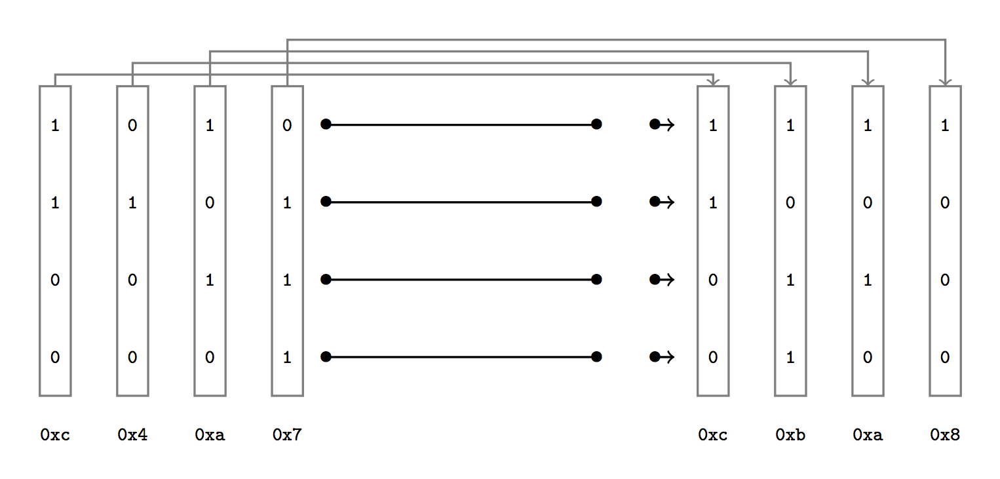
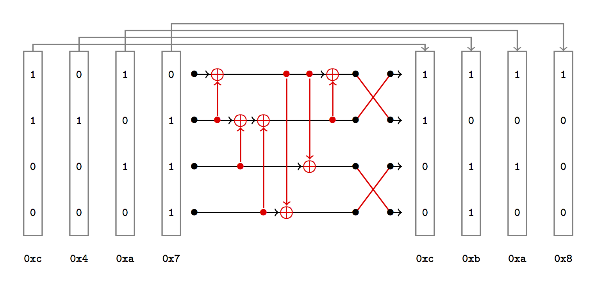

# FCSC 2020 RXoring Networks

Nous vous proposons l’étude des réseaux de XOR (Xoring Networks) et le problème XNP associé. Plus d’informations sont données dans le [DETAILS.md](DETAILS.md)

Une version plus simple de cette épreuve est disponible ici : Xoring Networks (Baby).

[DETAILS.md](DETAILS.md)

---

Auteur : [Cryptanalyse](https://twitter.com/Cryptanalyse)

Origine : [Xoring Networks](https://hackropole.fr/fr/challenges/misc/fcsc2020-misc-xoring-networks/)

## Connectez vous en WEBSSH
> http://localhost

#### tentez 
> nc xoring-networks.cyrhades.com:4000

-----------

## Ou directement avec netcat
> nc localhost:4000

-----------

## Installation manuel
Vous n'utilisez pas l'application **les CTFs de Cyrhades** ? C'est dommage !
Mais voici comment installer ce CTF manuellement :

> git clone https://github.com/Hack-Oeil/fcsc2020-misc-xoring-networks.git

> cd fcsc2020-misc-xoring-networks

-----------

## Sur le site officiel hackropole.fr
> https://hackropole.fr/fr/challenges/misc/fcsc2020-misc-xoring-networks/